## Contents
* [Introduction](#Krafts)
* [UX](#UX)
    * [User Stories](#User-Stories)
* [Structure](#Structure)
* [Design](#Design)
* [Wireframes](#Wireframes)
    * [Differences Between Wireframes and Final Product](#Differences-Between-Wireframes-and-Final-Product)
* [Database Design](#Database-Design)
    * [Product Model](#Product-Model)
    * [Category Model](#Category-Model)
    * [Comments Model](#Comments-Model)
    * [Message Model](#Message-Model)
    * [Order Model](#Order-Model)
    * [OrderLineItem Model](#OrderLineItem-Model)
    * [UserProfile Model](#UserProfile-Model)
* [Features](#Features)
    * [The Header](#The-Header)
    * [The Home Page](#The-Home-Page)
    * [The Footer](#The-Footer)
    * [The Products Page](#The-Products-Page)
    * [The Product Detail Page](#The-Product-Detail-Page)
    * [The Cart](#The-Cart)
    * [The Product Management Page](#The-Product-Management-Page)
    * [The Profile Page](#The-Profile-Page)
    * [The Checkout Page](#The-Checkout-Page)
    * [The Checkout Success Page](#The-Checkout-Success-Page)
    * [The Order History Oage](#The-Order-History-Page)
* [Potential Future Features](#Potential-Future-Features)
* [Technologies Used](#Technologies-Used)
    * [Languages Used](#Languages-Used)
    * [Frameworks, Libraries & Programs Used](#Frameworks-,-Libraries-&-Programs-Used)
* [Testing](#Testing)
* [Security](#Security)
* [Deployment](#Deployment)
    * [Project Creation](#Project-Creation)
    * [Connecting to Heroku](#Heroku)
    * [Forking the GitHub Repository](#Forking-the-GitHub-Repository)
    * [Run Locally](#Run-Locally)
* [Credits](#Credits)
    * [Code](#Code)
    * [Media](#Media)
    * [Acknowledgements](#Acknowledgements)

# Krafts

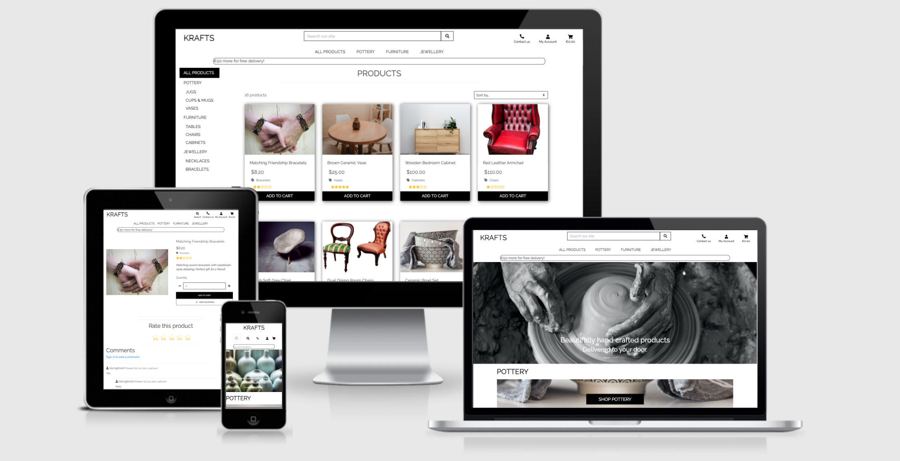

View the live project [here](https://krafts-dreid.herokuapp.com/)

Admin Sign In Info:
Username: admin
Password: admin
email: admin.admin@admin.com

This website was created for Code Institute's Milestone 4 Project as part of the Diploma in Full Stack Web Development. The purpose of this project is to demonstrate the student's knowledge and skills acquired throughout the course. This includes skills in languages such as HTML, CSS, JavaScript and Python as well as other technologies as outlined in the [Technologies Used](#Technologies-Used) section. The focus of this project is to demonstrate the student's ability incorporate these front and back end skills into a Full Stack project.
This project marks the developer's first time using the Django framework.

The purpose of this site is to provide users with a means to purchase hand crafted products. The original idea for the site was for artists to create their own store on the site, with users being able to browse products and also browse individual stores.

Due to time constraints, the site is currently a single store ecommerce site offering handmade products of different categories which facilitates the shopping experience from start to finish. Shelved features as well as potential other features can be found in the [Potential Future Features](#Potential-Future-Features) section.

## UX
### User Stories

|**As a...**|**I want to...**|**So I can...**|
|:-----|:-----|:-----|
|Potential customer|Immediately understand the purpose of the site|Decide if the site is for me|
||Easily browse products|Decide if I'm interested in them base on look, price, description and rating|
||Easily browse the site|Instinctively find what site services I am looking for|
||Easily create an account|Purchase, rate, and comment on products|
||Add items to my shopping cart prior to registration|Purchase products without committing to registering an account|
||Easily access product detail|Learn more about the product before purchase|
||Search for products using key words|Find specific products|
||Filter by price|Find products within my price range|
||Filter by rating|See the popularity of the products|
||Read product comments/see ratings|Make an informed purchase decision|
|Registered user|Save my details|Checkout more easily for future purchases|
||View my purchase history|Keep track of my purchases|
||Comment on products|Express my opinion or inquire about different products|
||Rate products|Express my opinion on different products|
||Contact the site owner|Express concerns and make inquiries|
||View my cart prior to checkout|review my order|
||Receive confirmation of purchases|Keep account of my purchases|
||Easily know free delivery threshold|Know how much I need to spend to qualify for free delivery|
|Site owner|View, add, edit and delete all products|Rotate stock and keep stock up to date|
||Have an easy user experience|Manage my site without need for advanced computer skills|
||Facilitate the needs of customers|Retain custom and engage with customers when needed|

[^ Back To Top ^](#Contents)


## Structure
Krafts is a standard ecommerce store where users can browse a variety of products using an array or sorting, searching, and filtering methods. Users are met with a home screen from which they can get their particular user experience started easily. All areas of the site that are available to shoppers can be accessed via the fixed responsive navbar at the top of the page

Potential shoppers can access products filtered how they please in a single products page. They can further explore individual products in a product detail page, on which they can also rate and comment on the products.

Shoppers are also provided with a cart in which they can store items for purchase as well as adjust quantities of certain products. They are also provided with a Profile page where they can also review and update their shipping as well as view their order history.

Shoppers can also easily access the sites contact information, as well as send emails directly from the Contact page

The site owner has access to additional features including a Product Management page where they can add products to the site. As well as this, the site owner can edit and any product on the site via an additional edit and delete buttons displayed wherever a product is displayed.

More on what each page does and how it functions will be discussed in the [Features](#Features) of this README.md file.

[^ Back To Top ^](#Contents)

## Design
* Colour Scheme
    * The colour scheme of this site was kept very simple so as to keep emphasis on the primary purpose of the store; to browse and purchase products.

        The primary colours used are black and white for a simple contrast that does not distract from the prominence of the product images. An aqua colour #17a2b8 was used to indicate information about the purchase to users. It is used on the cart icon in the header to indicate the presence of item in the cart, as well as in the progress bar to indicate to users how close they are to the free delivery threshold.

        For admins, simple blue and red text is used to indicate their additional features, such as editing and deleting products and comments. Editing and deleting comments is also available to registered users. 
        
        A dull grey is used for headings and placeholders, while default Bootstrap colours are used for the custom toasts feature in the message container


* Typography
    * Raleway is used throughout the site. It's a simple font that doesn't distract. It was sourced from [Google Fonts](https://fonts.google.com/)

* Imagery
    * Images were sourced from sites that provide images for free. The images displayed on the Home page and for the individual products were carefully chosen to reflect the handmade ethos of the site. The images are stored in the database in both url and file format.

[^ Back To Top ^](#Contents)

## Wireframes
Below are rough wireframes for the main pages of the site.


### Differences Between Wireframes and Final Product

* The biggest visual difference between the wireframe and the latest version of the site, is the replacement of the product cards with the parallex category links on the Home page. The links are more reflective of the purpose of the Home page, which is to serve as an introduction to the site, rather than to be part of the shopping experience.

* On the Products page, a notable inclusion is the side navigation element on medium screens upwards. It serves as an intuitive navigation with any active categories being highlighted. This replaces the need for the active category links displayed at the top of the page on smaller screens.

* On smaller screens, the main nav menu dropdown has been moved to the header in line with other menu items.

* The product cards include an "Add To Cart" button along with some other minor display alterations, including the star rating.

* The filter toggle button was dropped in favaour of displaying the sorting dropdown as is.

* On smaller to medium screens, the all menu items and links in the header and represented by icons, with no text on small screens, and minimal text on medium screens. The search bar is toggled with a search icon on these screen sisez.

* Also, on the header, a progress bar was included to indicate to the user how close they are to qualifying for free delivery.

* The Contact menu item was included in the header, while the "Clearance" navigation item was deemed unnecessary and removed.

[^ Back To Top ^](#Contents)

## Database Design


This site was created using a relational database to store its data. SQLite was used during the project's development, with the files being migrated to Postgress during deployment. The site's database models are discussed below.

### Product Model

The Product model is the most integral model in this project. It defines how each product featured on the site is stored in the database.

* The Product model is related to the Category model via a Foreign key. This ensures that each product is placed in a related category.

* The 'sku' field is a CharField which is automatically generated each time a product is added to the database.

* The 'name', 'description', and 'price' fields (CharField, TextField, DecimalField) are all input by the admin while adding a product.

* Images are uploaded in two formats; a URLField and ImageField ('image_url', 'image' fields) by the admin while adding a product.

* The 'rating' field is an IntegerField that is updated each time a user rates a particular product. It is the sum total of every rate the product has received.

* The 'rates' field is a ManyToManyField and is related to the User model and records all of the users (amount of rates) a product has received.

* That 'rating_average' is a DecimalField which is calculated by dividing the rating field by the rates field.

This calculation is done in the rate_product() view in the products app's views file. In future versions of the site, I would opt to carry out this calculation using model methods.
        
### Category Model

The Category model has the important job of sorting products into their respective categories. It as two fields.

* The 'name' field is a CharField representing the programmatic name of the category.

* The 'friendly_name' is a CharField used for front end representation of the categories.

### Comments Model

The Comments model is used to store comments made by users under particular products.

* The 'product' is a ForeignKey which relates the comment to its respective product.

* The 'name' field is a ForeignKey which relates the comment to the user who wrote the comment.

* The 'comment' field is a TextField which records the contents of the comment.

* The 'date' field is a DateTimeField with an auto_now_add parameter set to True, ensuring that the date and time the comment was made is automatically added.

* Finally, the 'parent' fields is a ForeignKey which relates the model to itself. By recording whether or not a comment is in reply to another comment, comments can be nested inside other comments in the comments section of the Product Detail page.

    Two @property functions are defined below the Comments model in the products app's models file which determine whether a particular comment is a child or parent comment.

### Message Model

The Message model stores messages sent by users to the site owner. Any site user, including those who are not registered, can contact the site owner. Therefore, there is no ForeignKey attaching it to the User model.

* The 'full_name' field is a CharField which records the full name of the sender.

* The 'email' field is an EmailField and records the email address of the sender.

* The 'message' field is a TextField and stores the contents of the sender's message.

### Order Model

The Order model records each order made by a user.

* The 'order_number' CharField is automatically generated using the _generate_order_number() model method when an order is made.

* The 'user_profile' ForeignKey relates the order to the user making the order. It is not a required field, which allows for non-registered users to make orders.

* CharFields 'full_name', 'phone_number', 'postcode', 'town_or_city', 'street_address1', 'street_address1', and 'county' are input by the user when making an order.

* The 'email' (EmailField) and 'country' (CountryField) fields are also input by the user when making an order.

* The 'date' field is a DateTimeField with an auto_now_add parameter set to True, ensuring that the date and time the order was made is automatically added.

* The 'delivery_cost', 'order_total', and 'grand_total' CharFields are calculated using the update_total() model method when order is saved.

* The 'original_cart' TextField records the original cart that created order to allow duplicate orders to be added.

* The 'stripe_pid' CharField is a unique payment id that allows for duplicate orders to be added.

### OrderLineItem Model

The OrderLineItem model creates an order line item for each cart item and is then then attached to the order.

* The 'order' ForeignKey relates the order line item to its respective order.

* The 'product' ForeignKey records the specific product the line item is being created for via the Product model.

* The 'quantity' IntegerField records the quantity of a particular order product.

* The 'lineitem_total' DecimalField is automatically calculated when the line item is saved using the save() model method.

### UserProfile Model

The UserProfile model records the default delivery information and order history of each user.

* The 'user' OneToOneField relates the user profile to the user.

* The 'default_phone_number', 'default_street_address1', 'default_street_address2', 'defaul_town_or_city', 'county', and 'postcode' are optional CharFields.

* The 'default_country' CountryField is also optional.

The create_or_update_user_profile() method in the profiles app's models file either creates or updates a user's profile each time a user object is saved or updated.

[^ Back To Top ^](#Contents)

## Features

### The Header.

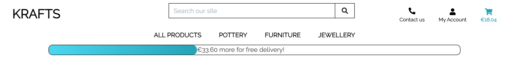

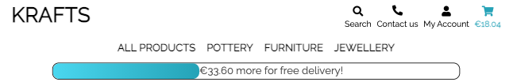

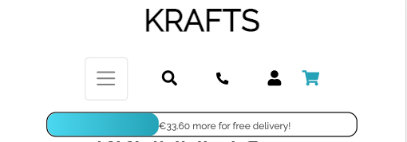

The header is fixed to the top of all site pages. It features:

* The Krafts logo which links to the Home Page.

* The search bar from which all users can enter key words to find specific products. The search bar appears as a regular search bar on larger screen, whereas on medium and smaller screens, it is toggled using a fontawsome search icon.

* The contact link which leads to the Contact page.

* The My Account dropdown which contains links to Product Management for the Admin, Profile Page, as well as Sign Up/Log In/Sign Out links (depending on the status of the user at the time).

* The cart link which leads users to their Cart. Information regarding user actions as well as cart information, and success/error messages are displayed in a toast that appears to drop down from the cart link. The toast is colour coded based on the information that is being displayed. For example, green for success messages, red for error messages, aqua #17a2b8 for informative messages.

    The cart icon will also appear aqua #17a2b8 if there is an item present in the cart.

* The main navigation menu which divides all products into categories and subcategories. All products can be accessed through the main navigation links. On smaller screens, these navigation links are accessed by a toggle dropdown button.

* The free delivery bar which informs users how close they are to qualifying for free delivery. The progress bar uses JavaScript to determine what percentage of the free delivery threshold the cart contents amounts to. The JavaScript code then sets the percentage width of the inner div of the progress bar to that percentage.

    The span that displays the free_delivery_delta is padded and located differently inside the progress bar depending on the width of the inner div using a combination of JavaScript and Jinja.

[^ Back To Top ^](#Contents)

### The Home Page

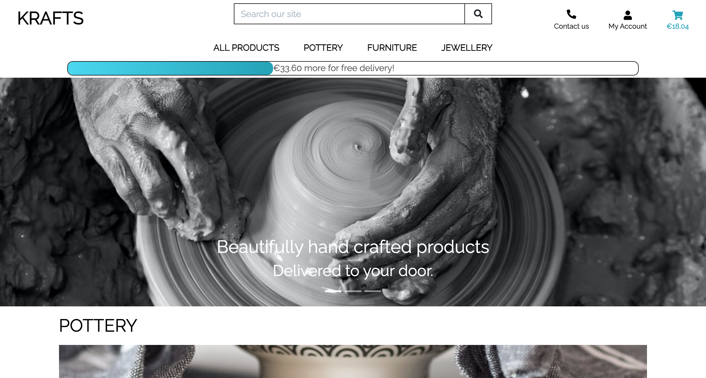

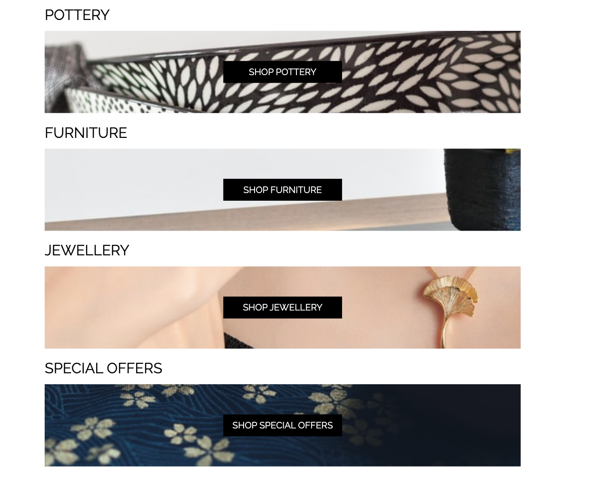

The home page is designed to be an intuitive introduction to the site where the user immediately learns the site's purpose. It includes:

* The hero carousel which is comprised of three images depicting various crafts to give an indication of the sites purpose. This Bootstrap carousel was surprisingly troublesome and time consuming and was difficult to make responsive. Eventually, the images were removed from the slider and were replaced with background images using CSS.

* The category links which are image-based links that lead to the different product categories. The images were carefully chosen to reflect their respective category. Again, the images were implemented as background images using css and have a parallax effect.

[^ Back To Top ^](#Contents)

### The Footer


The footer acts as a simple navigation tool and displays contact and social media links. It includes:

* The Krafts logo which leads to the Home page.

* The company address which doubles as a link to the Contact page.

* Social media links which lead to Facebook, Instagram and Twitter.

[^ Back To Top ^](#Contents)

### The Products Page

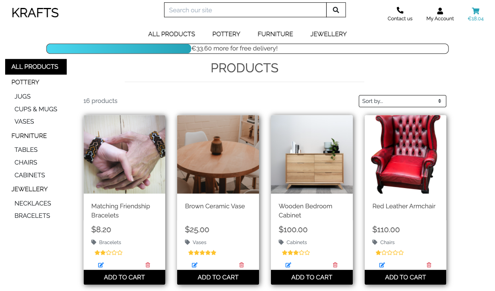

The products page is where all products are displayed based on search results, filters and sorting. It features:

* The side nav with which users can filter products by different categories and subcategories. The side nav is absent on smaller screens. The main nav is the only navigation on smaller screens, with current categories indicated at the top of the page by links.

* The Product card which display introductory information about the products. These are Bootstrap cards and display the product image, name, price, category and average rating (represented by stars). An "Add to cart" button at the bottom of the card adds the respective product the the cart. Additional edit and delete links on the cards allow Admins to perform these CRUD operations. Clicking the card's image will lead to the respective product's Product Detail page.

* The filter selector box which allows user to filter products base on name, price, rating and category, including in reverse order.

[^ Back To Top ^](#Contents)

### The Product Detail Page

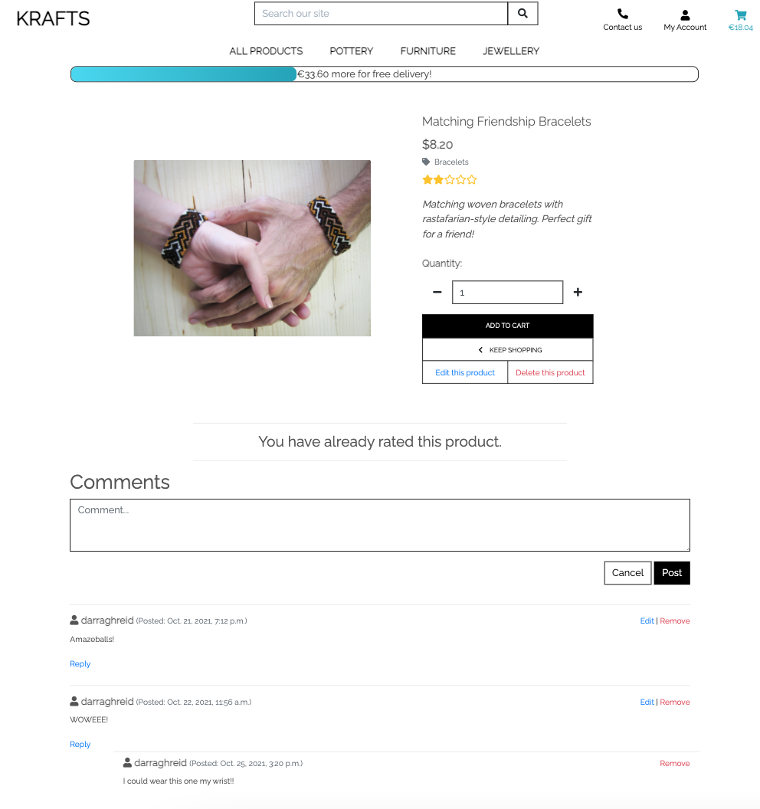
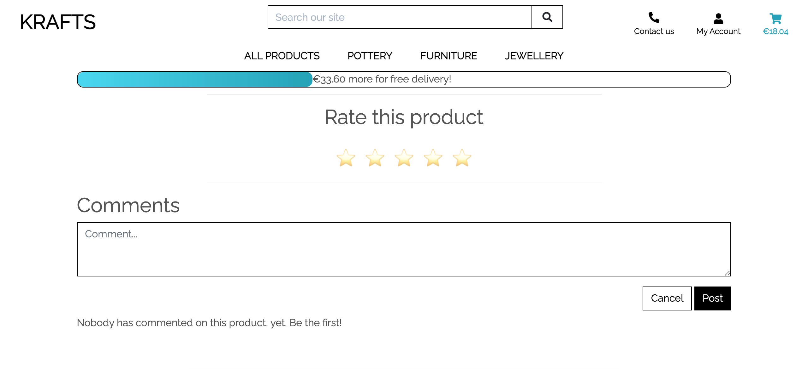

The Product Detail page allows user to view additional information about individual products and perform some actions. It features:

* The same product information as displayed on the card with the addition of the "details" field of the Product model.

* A form to add the product to the cart that allows the user to select the quantity of the product either by typing or using increment and decrement buttons.

* A Keep Shopping button that leads users back to the products page to continue shopping.

* Additional Edit and Delete buttons for admins to perform these CRUD operations.

* A rating form that allows users to give the product a rating out of 5. The form is hidden and is represented by 5 stars. Upon clicking a star, rating input of the Product form is updated and submitted using JavaScript. After the user has rated the product, the form is no longer accessible and is replaced with a message informing the user that they have already rated that product.

* A comments form which allows users to make comments about the this particular product. The comments form is pre-filled with the user's and the product's information, with only the comment field of the from displayed and filled by the user. Upon submission, the comment is recorded in the Comments model in the database.

* The comments section where users can see comments left by themselves and other users, and where Admins can reply to comments. The Comment model has a parent field that is a foreign key to itself. It indicates if the comment is being reply to, or is in reply to another comment. The comments that are in reply to other comments and referred to as "child comments" and are nested under the comments they are in reply to.

    Users can also edit their own comments by clicking the Edit button which toggles the edit comment form. The reply form is also toggled when the reply button is clicked.

[^ Back To Top ^](#Contents)

### The Cart

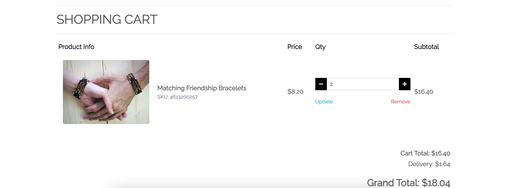

The cart displays all of the products the user has added to the cart and provides links to secure checkout. It features:

* A table which organises all of the products in the cart into rows with columns separating the products by relevant fields. These fields include Product Info, Price, Qty (quantity), and subtotal, which is an overall price calculation of the quantity of a particular product.

* Grand total calculator which calculates the total to be payed by a customer based on the free delivery requirements. Delivery will be free if the sum total of their items is greater than the free delivery threshold (currently set at 50 in the settings file). Otherwise, delivery will be set at 10% of the sum total of their items.

* A Keep Shopping button that leads users back to the products page to continue shopping.

* A Secure Checkout button which leads users to the Checkout page where they can checkout securely using Stripe.

[^ Back To Top ^](#Contents)

### The Product Management Page

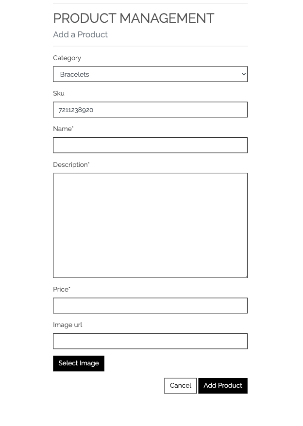

The Product Management page is accessible only to admins. It features:

* The Add Product form which admins can use to add products to the database. The form displays all fields of the Product Model apart from any fields related to the products rating. Products can only be rated by users on the Product Detail page.

[^ Back To Top ^](#Contents)

### The Profile Page

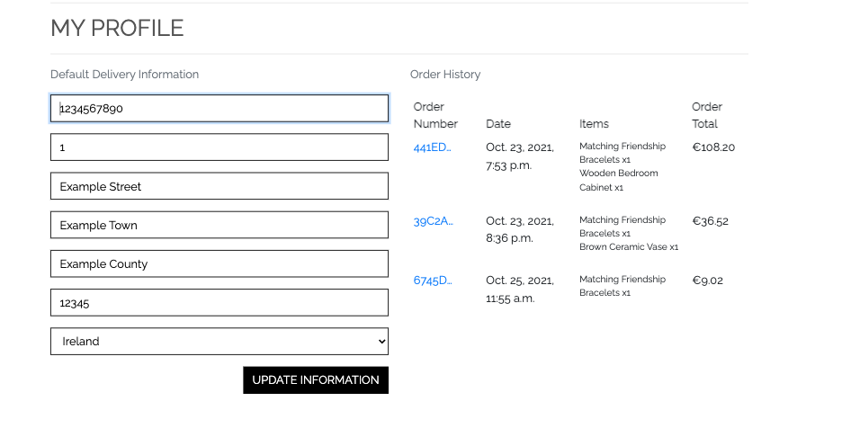

The Profile page is where information about the user is stored. It features:

* A form in which the user's default delivery information is stored. This form is pre-filled with the delivery information provided by the user during checkout and is stored in the database via the UserProfile model. It can be updated by the user on the Profile page.

* A table which displays the user's order history, including the Order Number, Date, Items purchased, and the Oder Total. The Order number is a link which leads to a separate Order History page. 

[^ Back To Top ^](#Contents)

### The Checkout Page


The Checkout page is where users can checkout securely using Stripe. It features:

* An OrderForm where users fill out delivery details which added to the database using the Order model.

    Included in this from is a payment field which is handled by Stripe.

* A summary of the order in a table format which displays the item image, item name and quantity, subtotal and calculated Grand Total.

[^ Back To Top ^](#Contents)

### The Checkout Success Page

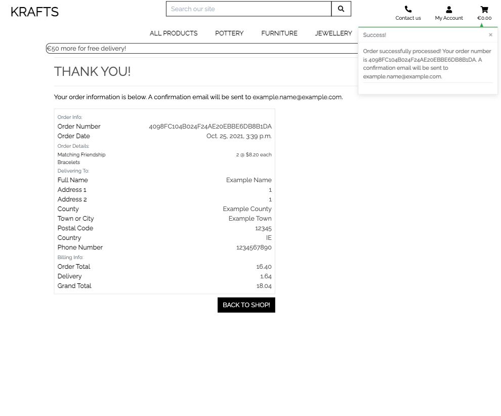

Users are sent a confirmation email and are led to the Checkout Success page upon successful completion of an order. It features:

* A thank you message as well a message informing the user that a confirmation email has been sent to the email they input in the OrderForm. 

* A detailed summary of the order including the product details, delivery details as well as billing information.

[^ Back To Top ^](#Contents)

### Order History Page


The Order History page is accessed via the Profile page by clicked on an Order Number. It displays a detailed summary of the respective order including the product details, delivery details as well as billing information.

[^ Back To Top ^](#Contents)

## Potential Future Features
* Set Up Shop

    As mentioned previously, the original idea of the site was to allow artists to set up their own virtual store to sell their products. Future versions of this site would allow sellers to have a distinct user status where tabs to access and upload their own products are available to them.

* Rating System

    Upon completion of the rating system, I realised I had designed it in such a way that users cannot modify their ratings. This is because, upon submission of a rating, the rating gets added to the rating field in the Product model, which is then divided by the number of times the product has been rated to get the average rating.

    Future versions of the site would have a separate Review model, with the Products model as foreign key, where users can create, edit and delete a review/rating of a product. Future versions of the site would also ensure that only users who have purchased the product can review it.

* Messages Tab

    Due to time constraints, plans to implement a messages tab in the user's profile were shelved. In future versions of the site, users will be able to access and track all of their previous correspondence with the site owner.

* Save For Later

    Also shelved was a "Save For Later" function. In future versions of the site, users will be able to save products that they are not yet ready to purchase to a "Saved" list that they can revisit.

* Pagination

    Pagination is another feature that didn't make the cut for this project. In future versions of the site, users will have access to pagination links at the bottom of the Products page which will reduce scrolling on larger search results.

[^ Back To Top ^](#Contents)

## Technologies Used 

### Languages Used 
* [HTML5](https://en.wikipedia.org/wiki/HTML5)
* [CSS3](https://en.wikipedia.org/wiki/CSS)
* [JavaScript](https://en.wikipedia.org/wiki/JavaScript)
* [Python](https://en.wikipedia.org/wiki/Python_(programming_language))
    * [Jinja](https://en.wikipedia.org/wiki/Jinja_(template_engine))
    * [Django](https://en.wikipedia.org/wiki/Django_(web_framework))
    * The following Python modules were used in the creation of this site:
        * asgiref==3.4.1
        * boto3==1.18.56
        * botocore==1.21.56
        * dj-database-url==0.5.0
        * Django==3.2.7
        * django-allauth==0.41.0
        * django-countries==7.2.1
        * django-crispy-forms==1.12.0
        * django-storages==1.11.1
        * gunicorn==20.1.0
        * jmespath==0.10.0
        * oauthlib==3.1.1
        * Pillow==8.3.2
        * psycopg2-binary==2.9.1
        * python3-openid==3.2.0
        * pytz==2021.1
        * requests-oauthlib==1.3.0
        * s3transfer==0.5.0
        * sqlparse==0.4.1
        * stripe==2.60.0

### Frameworks, Libraries & Programs Used
* [Balsamiq](https://balsamiq.com/)
    * Balsamiq was used to make the wireframes for the project

* [Bootstrap 5.0.0](https://getbootstrap.com/docs/5.0/getting-started/introduction/)
    * Bootstrap was used in conjunction with [jQuery](https://jquery.com/) extensively throughout the site.

        The site is very much a Bootstrap based site, with most major elements edited from Bootstrap templates.

        The Bootstrap grid system of rows and columns were most heavily relied upon to divide up the sites pages in order to ensure uniform layout.

        More prominently it was used to create the card elements that the products were displayed on. Bootstrap is also responsible for all modals seen throughout the site. Bootstrap classes were often used instead of CSS on other elements to assist with centering and positioning.

        Initialized with [jQuery](https://jquery.com/), the tooltips on all icons throughout the site are Bootstrap features.

        Of course, extensive editing had to be carried out on all Bootstrap elements throughout the site to get it functioning a looking the way it currently does. 

* [Fontawesome](https://fontawesome.com/)
    * All icons seen throughout the site were sourced from Fontawesome.
    
* [Git](https://git-scm.com/)
    * The Gitpod terminal was used to commit to Git and push to Github.

* [GitHub](https://github.com/)
    * Github was used to store the code from the project.

* [Google Dev Tools](https://developer.chrome.com/docs/devtools/)
    * Google Dev Tools was extensively used throughout the project, especially for testing code, and addressing bugs.

* [Google Fonts](https://fonts.google.com/)
    * Raleway, the font used throughout the site, was sourced from Google Fonts.

* [jQuery](https://jquery.com/)
    * jQuery was used in conjunction with Bootstrap on various elements throughout the site.

* [SQLite](https://www.sqlite.org/index.html)
    * SQLite was used to store the site's data during the creation and development of this project.

* [Heroku Postgres](https://www.heroku.com/postgres)
    * Heroku Postgres is an SQL database and was used to store the site's data in separate models post deployment.

* [Stripe](https://stripe.com/ie)
    * Stripe payments were used to build the site's card payment.

* [AWS-Amazon Web Services](https://aws.amazon.com/)
    * AWS was used to store all the site's media and static files in production mode.

* [Heroku](https://id.heroku.com/login)
    * Heroku was used to deploy this site.

* [Github](https://github.com/)
    * Github was used for version control as well as storing files and documents.

* [Gitpod](https://gitpod.io/)
    * The Gitpod IDE was used to build this project.

* [Am I Responsive](http://ami.responsivedesign.is/)
    * Am I Responsive was used to produce the image displaying the website on different screen sizes at the beginning of this document.

[^ Back To Top ^](#Contents)

## Testing
Information on testing can be found in a separate [TESTING.md](/TESTING.md) file.

## Deployment

### Project Creation
This project was created by using the following steps:

1. Log in to [GitHub](https://github.com/).
2. In the Repositories section, click the green "New" button.
3. Under "Repository template", select "Code-Institute-Org/gitpod-full-template".
4. Enter repository name (krafts).
5. Click "Create repository".
6. When re-directed, select the green "Gitpod" button to open workspace. Only do this step once; open workspace from [Gitpod Workspaces](https://gitpod.io/workspaces/) in future. 

Use [Git](https://git-scm.com/) CLI commands for version control:
* To move files to the staging area, use "git add" followed by the name of the file, or "git add -A" for all files.
* To save your changes to your local repository, use "git commit -m" followed by a short, descriptive message detailing the changes you have made. Ensure the message is wrapped in quotes.
* To push the changes to the GitHub repo, use "git push".

### Heroku
This project was deployed to Deployment to Heroku using the following steps:

1. Set up a requirements.txt file and a Procfile to tell Heroku which applications and dependencies are required.
    * Type "pip3 freeze --local > requirements.txt" to create a requirements.txt file.
    * Type "echo web: python app.py > Procfile" to creat a Procfile.
    * Push these files to Github using the CLI command outlined above
    * Install`psycopg2` and `dj_datatbase_url` to allow Postgres to be used on the Deployed site using the following CLI commands:

        pip3 install dj_database_url
        pip3 install psycopg2

2. Create Heroku App
    * Log into [Heroku](https://id.heroku.com/login).
    * Click the "New" button in the top right corner of the page, and select create new app.
    * Enter app name and select the region closest to you ("Europe" in this case).

3. Connect Heroku to Github
    * Click on the "Deploy" tab, select "GitHub", and then "Connect to GitHub".
    * When a prompt appears to find a github repository to connect to, enter the repo name created on Github ("krafts" in this case)
    * Click search, and click the connect button if the correct repository has been found.

5. Add Heroku Postgres Database
    * Navigate to your new Heroku app
    * Click the Resources tab.
    * Under Add-ons enter "Heroku Postgres".
    * Selct Heroku Postgres. 
    * Under "Plan Name," select the Hobby Dev-Free option. 
    * Click "Submit Order Form".
    * In the CLI
        * Create a Superuser by entering this command and following the prompts
            "python manage.py createsuperuser"
        * use the following commands to migrate your database to Postgres
            "heroku login -i"
            "heroku run python manage.py migrate"
    * Temporarily disable Heroku's static file collection with the following command
        "heroku config:set DISABLE_COLLECTSTATIC=1 --app [app name]
    * Add the hostname of your Heroku app to settings.py:
        ALLOWED_HOSTS = ['[app name]herokuapp.com', ';ocalhost']

5. Set environment variables
    * Click on the "Settings" tab, then "Reveal Config Vars", and add the following information:
        * AWS_ACCESS_KEY_ID
        * AWS_SECRET_ACCESS_KEY
        * DATABASE_URL
        * EMAIL_HOST_PASS
        * EMAIL_HOST_USER
        * SECRET_KEY
        * STRIPE_PUBLIC_KEY
        * STRIPE_SECRET_KEY
        * STRIPE_WH_SECRET
        * USE_AWS

6. Enable automatic deployment
    * Click the "Deploy" tab.
    * Choose the branch you wish to deploy and click "Enable Automation Deploys".

7. Setting up the AWS s3 bucket
    * Create an Amazon AWS account
    * Search for S3 and create a new bucket
        - Allow public access
    * Under Properties > Static website hosting
        - Enable
        - index.html as index.html
        - save
    * Under Permissions > CORS use the following:
    ```
    [
    {
        "AllowedHeaders": [
            "Authorization"
        ],
        "AllowedMethods": [
            "GET"
        ],
        "AllowedOrigins": [
            "*"
        ],
        "ExposeHeaders": []
    }
    ]
    ```
    * Under Permissions > Bucket Policy:
        - Generate Bucket Policy and take note of Bucket ARN
        - Chose S3 Bucket Policy as Type of Policy
        - For Principal, enter *
        - Enter ARN noted above
        - Add Statement
        - Generate Policy
        - Copy Policy JSON Document
        - Paste policy into Edit Bucket policy on the previous tab
        - Save changes
    * Under Access Control List (ACL):
        - For Everyone (public access), tick List
        - Accept that everyone in the world may access the Bucket
        - Save changes

8. Setting up AWS IAM (Identity and Access Management)
    * From the IAM dashboard within AWS, select User Groups:
        - Create new group e.g. `[name]-juice`
        - Click through without adding a policy
        - Create Group
    * Select Policies:
        - Create policy
        - Under JSON tab, click Import managed policy
        - Choose AmazongS3FullAccess
        - Edit the resource to include the Bucket ARN noted earlier when creating the Bucket Policy:
        ```
                    "Resource": [
                                    "arn:aws:s3:::[name]",
                                    "arn:aws:s3:::[name]/*"
                    ]
        ```
        - Click next step and go to Review policy
        - Give the policy a name e.g. `[name]` and description
        - Create policy
    * Go back to User Groups and choose the group created earlier
        - Under Permissions > Add permissions, choose Attach Policies and select the one just created
        - Add permissions
    * Under Users:
        - Choose a user name e.g. `[name]-staticfiles-user`
        - Select Programmatic access as the Access type
        - Click Next
        - Add the user to the Group just created
        - Click Next and Create User
    * Download the `.csv` containing the access key and secret access key. 
        NOTE: This will NOT be available to download again.

9. connecting Heroku to AWS S3
    * Install boto3 and django-storages
    ```
    pip3 install boto3
    pip3 install django-storages
    pip3 freeze > requirements.txt
    ```
    * Add the values from the `.csv` you downloaded to your Heroku Config Vars under Settings:
    * Delete the `DISABLE_COLLECTSTATIC` variable from your Cvars and deploy your Heroku app
    * With your S3 bucket now set up, you can create a new folder called media (at the same level as the newly added static folder) and upload any required media files to it.
        ENSURE `media` AND `static` FILES ARE PUBLICLY ACCESSIBLE UNDER PERMISSIONS

### Forking the GitHub Repository

Forking the GitHub repository allows us to make a copy of our original repository where changes can be made without affect the original copy.
To do this, follow these steps:

1. Log in to GitHub.
2. Select your repository.
3. Locate and click the "Fork" in the top right corner, under the nav bar.
4. A copy of the original repository should have been created in your GitHub account.

### Run Locally

1. Log in to GitHub.
2. Locate repository.
3. Locate and click the "Code" dropdown menu.
4. Under HTTPS, copy the URL.
5. Open your development editor and a terminal window in your chosen directory.
6. In the terminal, type "git clone " followed by the URL you copied in step 4 and press enter.
7. A clone of the project should have been created.
    Ensure the necessary requirements are installed by using the following command.

    -pip install -r requirements.txt

[^ Back To Top ^](#Contents)

## Credits

### Code

A variety of online material was consulted in the making of this product, from posts on forums to YouTube videos. All of the content was extensively edited to suit this particular site and is referenced below.

* [Code Institute's](https://codeinstitute.net/) Boutique Ado walkthrough project by Chris Zielinski was instrumental in the creation of this project. From implementing the Products, Categories, and Orders models, to setting up Stripe Payments and AWS, his knowledge proved invaluable. Some design elements in Krafts were also borrowed from Boutique ado such as form design, headings, and some buttons.

* [This Stackoverflow Post](https://stackoverflow.com/questions/59147127/django-how-to-auto-generate-a-unique-number-string-for-a-model-attribute/59148235#59148235) was helpful in figuring out how to generate the product Sku upon adding a product.

* [This Codemy.com video](https://www.youtube.com/watch?v=xNqnHmXIuzU) was a good source of information for sending email confirmation when I was building the Contact app.

* The comments section, model and functionality was built after consulting information provided in the following videos by [Codemy.com](https://www.youtube.com/channel/UCFB0dxMudkws1q8w5NJEAmw) and [Legion Script](https://www.youtube.com/channel/UCF7k5gX55WvJ-SFXGsPsLTg) :
    * [Build A Blog Comments Section](https://www.youtube.com/watch?v=hZrlh4qU4eQ)
    * [Building a Social Media App With Python 3 and Django](https://www.youtube.com/watch?v=zcAp-O4q_Vk)

* [This](https://www.youtube.com/watch?v=dsRJTxieD4U) video by [Web Dev Junkie](https://www.youtube.com/channel/UCsrVDPJBYeXItETFHG0qzyw) was a great reference for the creation of the site's star rating form.

* The rating display was heavily influenced by [Edb83's](https://github.com/Edb83) similar display which can be found [here](https://github.com/Edb83/moose-juice/blob/master/products/static/products/js/star-display.js).

### Media
* Details about the media files used in the site can be found in a separate [MEDIA.md](/MEDIA.md) file.

### Acknowledgements

I would like to thank the slack community for their assistance, tutor support for their patience and extensive knowledge, as well as my mentor Aaron Sinnott for his sound advice and insights.

[^ Back To Top ^](#Contents)